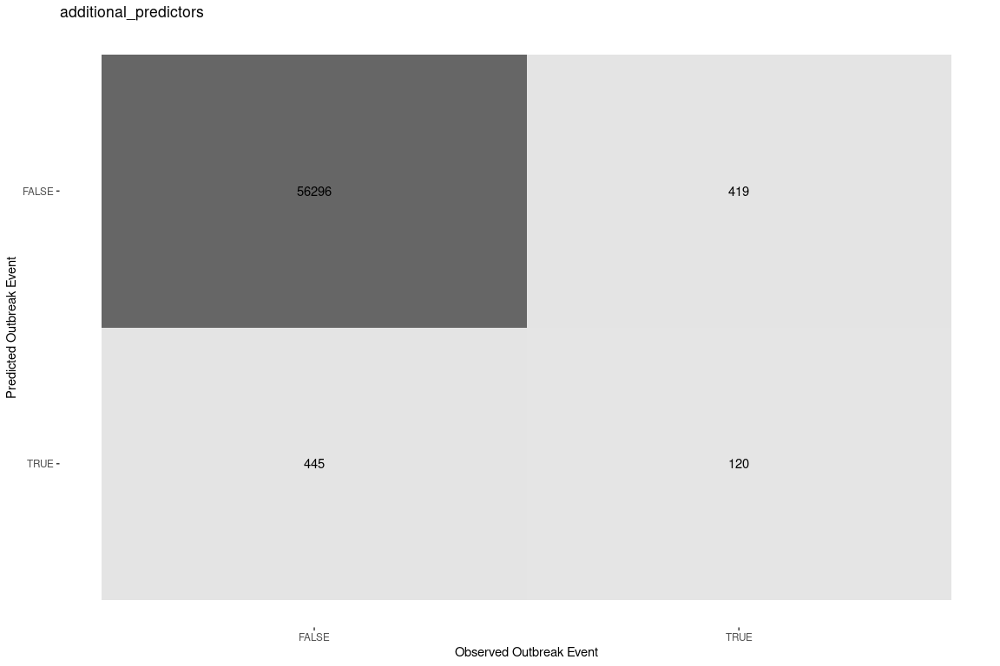
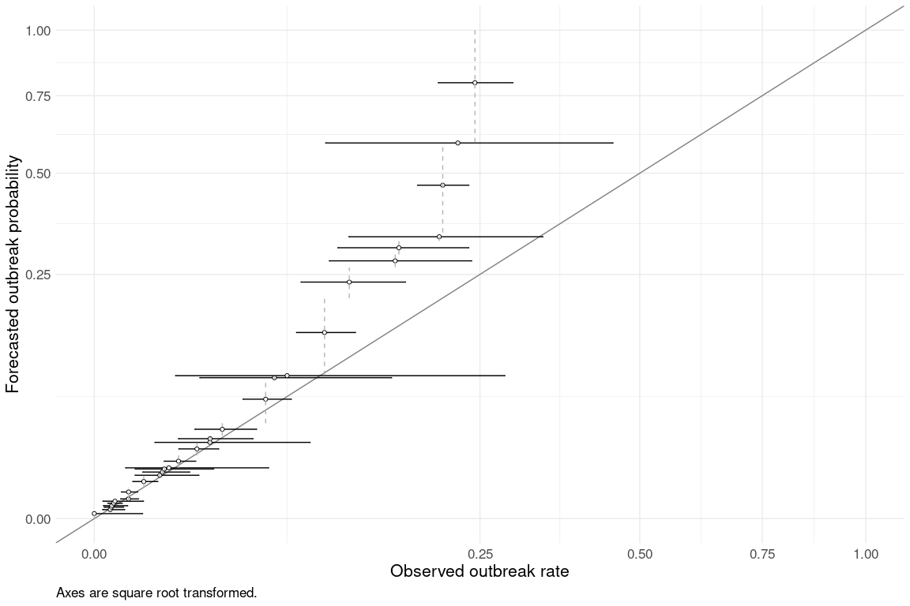
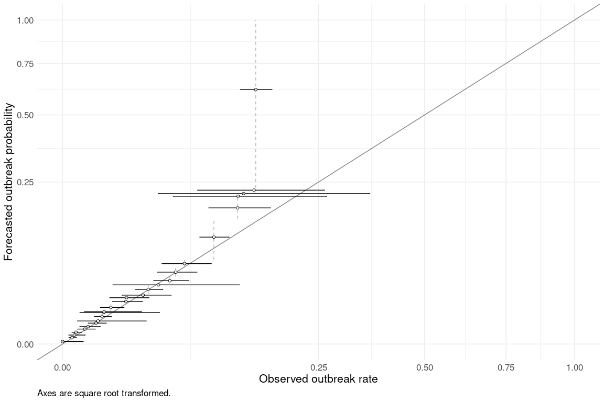
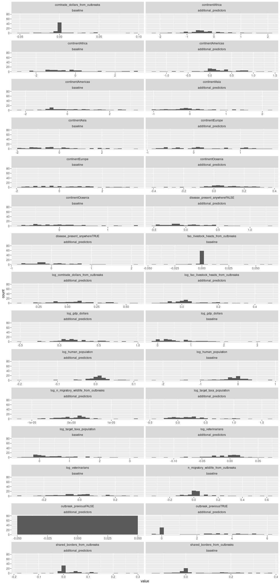

This report provides a quick side-by-side comparison for updates to the REPEL model. 
The document "repel_model_updates.Rmd" contains the stand-alone latest results and is updated as part of the targets pipeline.
Because of the reliance on `relic` and locally-archived versions of our models, this document needs to be run manually outside of our targets pipeline.

The following changes are reflected here. We're starting with our yearly recalibration as the baseline for assessing performance changes. 
1. We shifted the model to a yearly time interval ("baseline")
2. Addition of two new predictors ("additional_predictors")


### Confusion Matrix

Model predictions are in the form of probabilities from 0-1.
We assumed that a prediction of \>= 0.5 indicates that the model predicted an outbreak event.

While confusion matrices and their summary statistics are standard metrics for binary models, they are limited for evaluating this model, which predicts rare events that generally have a probability well below 0.5.
Metrics which weight negative events reflect the large number of zeroes in the dataset.
Metrics focusing only on rare outbreak events (Kappa, Negative Predictive Value, Matthews correlation coefficient) reflect performance in very small number of cases where monthly import risk is above 50%.
Calibration curves (next section) provide a better measure of rare events.



<table class=" lightable-paper" style='font-family: "Arial Narrow", arial, helvetica, sans-serif; width: auto !important; '>
 <thead>
  <tr>
   <th style="text-align:left;"> .metric </th>
   <th style="text-align:left;"> .estimator </th>
   <th style="text-align:right;"> additional_predictors </th>
   <th style="text-align:right;"> baseline </th>
  </tr>
 </thead>
<tbody>
  <tr>
   <td style="text-align:left;"> accuracy </td>
   <td style="text-align:left;"> binary </td>
   <td style="text-align:right;"> 0.9849162 </td>
   <td style="text-align:right;"> 0.9860439 </td>
  </tr>
  <tr>
   <td style="text-align:left;"> kap </td>
   <td style="text-align:left;"> binary </td>
   <td style="text-align:right;"> 0.2097803 </td>
   <td style="text-align:right;"> 0.1000323 </td>
  </tr>
  <tr>
   <td style="text-align:left;"> sens </td>
   <td style="text-align:left;"> binary </td>
   <td style="text-align:right;"> 0.9921573 </td>
   <td style="text-align:right;"> 0.9940090 </td>
  </tr>
  <tr>
   <td style="text-align:left;"> spec </td>
   <td style="text-align:left;"> binary </td>
   <td style="text-align:right;"> 0.2226345 </td>
   <td style="text-align:right;"> 0.0943775 </td>
  </tr>
  <tr>
   <td style="text-align:left;"> ppv </td>
   <td style="text-align:left;"> binary </td>
   <td style="text-align:right;"> 0.9926122 </td>
   <td style="text-align:right;"> 0.9919273 </td>
  </tr>
  <tr>
   <td style="text-align:left;"> npv </td>
   <td style="text-align:left;"> binary </td>
   <td style="text-align:right;"> 0.2123894 </td>
   <td style="text-align:right;"> 0.1233596 </td>
  </tr>
  <tr>
   <td style="text-align:left;"> mcc </td>
   <td style="text-align:left;"> binary </td>
   <td style="text-align:right;"> 0.2098396 </td>
   <td style="text-align:right;"> 0.1009445 </td>
  </tr>
  <tr>
   <td style="text-align:left;"> j_index </td>
   <td style="text-align:left;"> binary </td>
   <td style="text-align:right;"> 0.2147919 </td>
   <td style="text-align:right;"> 0.0883865 </td>
  </tr>
  <tr>
   <td style="text-align:left;"> bal_accuracy </td>
   <td style="text-align:left;"> binary </td>
   <td style="text-align:right;"> 0.6073959 </td>
   <td style="text-align:right;"> 0.5441932 </td>
  </tr>
  <tr>
   <td style="text-align:left;"> detection_prevalence </td>
   <td style="text-align:left;"> binary </td>
   <td style="text-align:right;"> 0.9901362 </td>
   <td style="text-align:right;"> 0.9932264 </td>
  </tr>
  <tr>
   <td style="text-align:left;"> precision </td>
   <td style="text-align:left;"> binary </td>
   <td style="text-align:right;"> 0.9926122 </td>
   <td style="text-align:right;"> 0.9919273 </td>
  </tr>
  <tr>
   <td style="text-align:left;"> recall </td>
   <td style="text-align:left;"> binary </td>
   <td style="text-align:right;"> 0.9921573 </td>
   <td style="text-align:right;"> 0.9940090 </td>
  </tr>
  <tr>
   <td style="text-align:left;"> f_meas </td>
   <td style="text-align:left;"> binary </td>
   <td style="text-align:right;"> 0.9923847 </td>
   <td style="text-align:right;"> 0.9929670 </td>
  </tr>
</tbody>
</table>

<!-- ``` -->

### Calibration Curve

We assessed model predictions as probabilities against observed outbreak rates in the validation set.
We grouped predictions into 30 quantile-based bins.
We compared the average prediction of each bin to observed outbreak rates within the bin (represented as binomial probabilities and 95% confidence intervals).
Each prediction represents the expectation of an outbreak of a given disease in a country in a given month.
This assessment evaluates the reliability of predictions for rare events: given a predicted probability of a rare outbreak, how well is that probability borne out as a fraction of times that outbreaks actually occurred in the validation data?


```
## [[1]]
```

```
## 
## [[2]]
```




#### Yearly interval

<table class=" lightable-paper" style='font-family: "Arial Narrow", arial, helvetica, sans-serif; width: auto !important; '>
<caption>values are per 10,000 potential events</caption>
 <thead>
  <tr>
   <th style="text-align:right;"> Mean Prediction </th>
   <th style="text-align:left;"> Observed Outbreak Rate (mean and 95%CI) </th>
   <th style="text-align:left;"> Mean Prediction within 95%CI </th>
  </tr>
 </thead>
<tbody>
  <tr>
   <td style="text-align:right;"> 1.0 </td>
   <td style="text-align:left;"> 0 (0-39) </td>
   <td style="text-align:left;"> yes </td>
  </tr>
  <tr>
   <td style="text-align:right;"> 3.4 </td>
   <td style="text-align:left;"> 4.3 (1.2-16) </td>
   <td style="text-align:left;"> yes </td>
  </tr>
  <tr>
   <td style="text-align:right;"> 5.5 </td>
   <td style="text-align:left;"> 4.9 (1.7-14) </td>
   <td style="text-align:left;"> yes </td>
  </tr>
  <tr>
   <td style="text-align:right;"> 7.0 </td>
   <td style="text-align:left;"> 5.1 (1.4-19) </td>
   <td style="text-align:left;"> yes </td>
  </tr>
  <tr>
   <td style="text-align:right;"> 9.9 </td>
   <td style="text-align:left;"> 6.4 (3.1-13) </td>
   <td style="text-align:left;"> yes </td>
  </tr>
  <tr>
   <td style="text-align:right;"> 13.0 </td>
   <td style="text-align:left;"> 7.2 (1.3-41) </td>
   <td style="text-align:left;"> yes </td>
  </tr>
  <tr>
   <td style="text-align:right;"> 16.0 </td>
   <td style="text-align:left;"> 20 (12-33) </td>
   <td style="text-align:left;"> yes </td>
  </tr>
  <tr>
   <td style="text-align:right;"> 30.0 </td>
   <td style="text-align:left;"> 20 (12-32) </td>
   <td style="text-align:left;"> yes </td>
  </tr>
  <tr>
   <td style="text-align:right;"> 58.0 </td>
   <td style="text-align:left;"> 41 (25-68) </td>
   <td style="text-align:left;"> yes </td>
  </tr>
  <tr>
   <td style="text-align:right;"> 79.0 </td>
   <td style="text-align:left;"> 72 (28-180) </td>
   <td style="text-align:left;"> yes </td>
  </tr>
  <tr>
   <td style="text-align:right;"> 91.0 </td>
   <td style="text-align:left;"> 78 (40-150) </td>
   <td style="text-align:left;"> yes </td>
  </tr>
  <tr>
   <td style="text-align:right;"> 100.0 </td>
   <td style="text-align:left;"> 82 (28-240) </td>
   <td style="text-align:left;"> yes </td>
  </tr>
  <tr>
   <td style="text-align:right;"> 110.0 </td>
   <td style="text-align:left;"> 93 (17-510) </td>
   <td style="text-align:left;"> yes </td>
  </tr>
  <tr>
   <td style="text-align:right;"> 140.0 </td>
   <td style="text-align:left;"> 120 (82-170) </td>
   <td style="text-align:left;"> yes </td>
  </tr>
  <tr>
   <td style="text-align:right;"> 200.0 </td>
   <td style="text-align:left;"> 180 (120-260) </td>
   <td style="text-align:left;"> yes </td>
  </tr>
  <tr>
   <td style="text-align:right;"> 240.0 </td>
   <td style="text-align:left;"> 220 (62-780) </td>
   <td style="text-align:left;"> yes </td>
  </tr>
  <tr>
   <td style="text-align:right;"> 270.0 </td>
   <td style="text-align:left;"> 230 (120-420) </td>
   <td style="text-align:left;"> yes </td>
  </tr>
  <tr>
   <td style="text-align:right;"> 330.0 </td>
   <td style="text-align:left;"> 280 (170-440) </td>
   <td style="text-align:left;"> yes </td>
  </tr>
  <tr>
   <td style="text-align:right;"> 600.0 </td>
   <td style="text-align:left;"> 490 (370-650) </td>
   <td style="text-align:left;"> yes </td>
  </tr>
  <tr>
   <td style="text-align:right;"> 830.0 </td>
   <td style="text-align:left;"> 550 (190-1500) </td>
   <td style="text-align:left;"> yes </td>
  </tr>
  <tr>
   <td style="text-align:right;"> 860.0 </td>
   <td style="text-align:left;"> 620 (110-2800) </td>
   <td style="text-align:left;"> yes </td>
  </tr>
  <tr>
   <td style="text-align:right;"> 1500.0 </td>
   <td style="text-align:left;"> 890 (690-1100) </td>
   <td style="text-align:left;"> no </td>
  </tr>
  <tr>
   <td style="text-align:right;"> 2300.0 </td>
   <td style="text-align:left;"> 1100 (720-1600) </td>
   <td style="text-align:left;"> no </td>
  </tr>
  <tr>
   <td style="text-align:right;"> 2800.0 </td>
   <td style="text-align:left;"> 1500 (930-2400) </td>
   <td style="text-align:left;"> no </td>
  </tr>
  <tr>
   <td style="text-align:right;"> 3100.0 </td>
   <td style="text-align:left;"> 1600 (1000-2400) </td>
   <td style="text-align:left;"> no </td>
  </tr>
  <tr>
   <td style="text-align:right;"> 3300.0 </td>
   <td style="text-align:left;"> 2000 (1100-3400) </td>
   <td style="text-align:left;"> yes </td>
  </tr>
  <tr>
   <td style="text-align:right;"> 4700.0 </td>
   <td style="text-align:left;"> 2000 (1800-2400) </td>
   <td style="text-align:left;"> no </td>
  </tr>
  <tr>
   <td style="text-align:right;"> 5900.0 </td>
   <td style="text-align:left;"> 2200 (900-4500) </td>
   <td style="text-align:left;"> no </td>
  </tr>
  <tr>
   <td style="text-align:right;"> 8000.0 </td>
   <td style="text-align:left;"> 2400 (2000-2900) </td>
   <td style="text-align:left;"> no </td>
  </tr>
</tbody>
</table>

#### Two new predictors

<table class=" lightable-paper" style='font-family: "Arial Narrow", arial, helvetica, sans-serif; width: auto !important; '>
<caption>values are per 10,000 potential events</caption>
 <thead>
  <tr>
   <th style="text-align:right;"> Mean Prediction </th>
   <th style="text-align:left;"> Observed Outbreak Rate (mean and 95%CI) </th>
   <th style="text-align:left;"> Mean Prediction within 95%CI </th>
  </tr>
 </thead>
<tbody>
  <tr>
   <td style="text-align:right;"> 0.6 </td>
   <td style="text-align:left;"> 0 (1.1e-15-16) </td>
   <td style="text-align:left;"> yes </td>
  </tr>
  <tr>
   <td style="text-align:right;"> 3.9 </td>
   <td style="text-align:left;"> 3.3 (1.5-7.3) </td>
   <td style="text-align:left;"> yes </td>
  </tr>
  <tr>
   <td style="text-align:right;"> 7.6 </td>
   <td style="text-align:left;"> 5.4 (1.5-20) </td>
   <td style="text-align:left;"> yes </td>
  </tr>
  <tr>
   <td style="text-align:right;"> 13.0 </td>
   <td style="text-align:left;"> 6.9 (3.4-14) </td>
   <td style="text-align:left;"> yes </td>
  </tr>
  <tr>
   <td style="text-align:right;"> 21.0 </td>
   <td style="text-align:left;"> 19 (8.6-41) </td>
   <td style="text-align:left;"> yes </td>
  </tr>
  <tr>
   <td style="text-align:right;"> 29.0 </td>
   <td style="text-align:left;"> 25 (11-54) </td>
   <td style="text-align:left;"> yes </td>
  </tr>
  <tr>
   <td style="text-align:right;"> 42.0 </td>
   <td style="text-align:left;"> 43 (25-73) </td>
   <td style="text-align:left;"> yes </td>
  </tr>
  <tr>
   <td style="text-align:right;"> 50.0 </td>
   <td style="text-align:left;"> 48 (8.5-270) </td>
   <td style="text-align:left;"> yes </td>
  </tr>
  <tr>
   <td style="text-align:right;"> 72.0 </td>
   <td style="text-align:left;"> 59 (38-92) </td>
   <td style="text-align:left;"> yes </td>
  </tr>
  <tr>
   <td style="text-align:right;"> 94.0 </td>
   <td style="text-align:left;"> 65 (11-360) </td>
   <td style="text-align:left;"> yes </td>
  </tr>
  <tr>
   <td style="text-align:right;"> 99.0 </td>
   <td style="text-align:left;"> 66 (18-240) </td>
   <td style="text-align:left;"> yes </td>
  </tr>
  <tr>
   <td style="text-align:right;"> 130.0 </td>
   <td style="text-align:left;"> 89 (55-140) </td>
   <td style="text-align:left;"> yes </td>
  </tr>
  <tr>
   <td style="text-align:right;"> 170.0 </td>
   <td style="text-align:left;"> 150 (95-240) </td>
   <td style="text-align:left;"> yes </td>
  </tr>
  <tr>
   <td style="text-align:right;"> 200.0 </td>
   <td style="text-align:left;"> 160 (85-280) </td>
   <td style="text-align:left;"> yes </td>
  </tr>
  <tr>
   <td style="text-align:right;"> 230.0 </td>
   <td style="text-align:left;"> 250 (130-450) </td>
   <td style="text-align:left;"> yes </td>
  </tr>
  <tr>
   <td style="text-align:right;"> 280.0 </td>
   <td style="text-align:left;"> 280 (200-380) </td>
   <td style="text-align:left;"> yes </td>
  </tr>
  <tr>
   <td style="text-align:right;"> 330.0 </td>
   <td style="text-align:left;"> 350 (97-1200) </td>
   <td style="text-align:left;"> yes </td>
  </tr>
  <tr>
   <td style="text-align:right;"> 380.0 </td>
   <td style="text-align:left;"> 440 (320-600) </td>
   <td style="text-align:left;"> yes </td>
  </tr>
  <tr>
   <td style="text-align:right;"> 490.0 </td>
   <td style="text-align:left;"> 490 (340-690) </td>
   <td style="text-align:left;"> yes </td>
  </tr>
  <tr>
   <td style="text-align:right;"> 620.0 </td>
   <td style="text-align:left;"> 570 (380-840) </td>
   <td style="text-align:left;"> yes </td>
  </tr>
  <tr>
   <td style="text-align:right;"> 1100.0 </td>
   <td style="text-align:left;"> 870 (720-1100) </td>
   <td style="text-align:left;"> no </td>
  </tr>
  <tr>
   <td style="text-align:right;"> 1800.0 </td>
   <td style="text-align:left;"> 1200 (820-1600) </td>
   <td style="text-align:left;"> no </td>
  </tr>
  <tr>
   <td style="text-align:right;"> 2100.0 </td>
   <td style="text-align:left;"> 1200 (470-2700) </td>
   <td style="text-align:left;"> yes </td>
  </tr>
  <tr>
   <td style="text-align:right;"> 2200.0 </td>
   <td style="text-align:left;"> 1200 (350-3600) </td>
   <td style="text-align:left;"> yes </td>
  </tr>
  <tr>
   <td style="text-align:right;"> 2300.0 </td>
   <td style="text-align:left;"> 1400 (700-2600) </td>
   <td style="text-align:left;"> yes </td>
  </tr>
  <tr>
   <td style="text-align:right;"> 6200.0 </td>
   <td style="text-align:left;"> 1400 (1200-1700) </td>
   <td style="text-align:left;"> no </td>
  </tr>
</tbody>
</table>

### Coefficients
This looks at the distribution of random effects (coefficients) for each variable. There is a random effect for each disease for each variable. 

Note: Our model does not include fixed effects for each variable, only random effects by disease. `randef(mod)` returns individual slopes by disease, which _can_ be interpreted as slopes (positive or negative relationships, magnitude of effect). These slopes are drawn from a normal distribution. If we had included a fixed effect for the variables, the random effect slopes would be offsets that you add to the fixed effect slope.

So, variables with higher magnitudes of effects (either positive or negative) have a greater overall effect on the probability of disease outbreak. Coefficients around 0 do not predict disease outbreak.   

The relationship between GDP and outbreak probability is positive for almost all diseases. For some diseases, that slope is highly positive.

The relationship between each continent and outbreak probability can be positive or negative, depending on the disease. And the effects can be steep in either direction. This makes sense, as some diseases are going to be highly associated with a given continent.

The magnitude of the effect of comtrade and FAO is low overall. 

<!-- -->


<details>
<summary>Session info</summary>

-   Built at: 2024-04-29 18:45:05.338786
-   Last git commit hash: d834ef04db7dc58a8770d45386b832f4dbd77841

</details>

