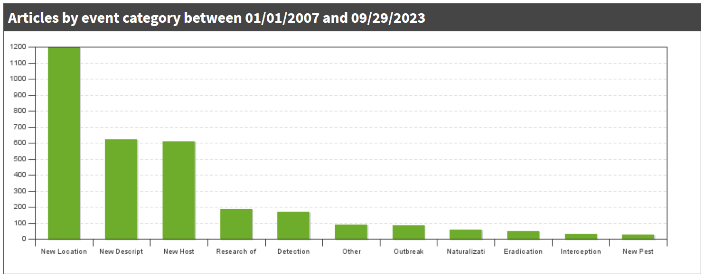

```{r setup, include=FALSE}
knitr::opts_chunk$set(echo = FALSE, message = FALSE, warning = FALSE, fig.height=8, fig.width=12)
library(knitr)
library(targets)

library(ggplot2)
h <- here::here

tar_load(eppo_index_processed, store = h("_targets_s3"))
tar_load(ippc_table_processed, store = h("_targets_s3"))
tar_load(nappo_table_processed, store = h("_targets_s3"))
tar_load(pest_names_standardized, store = h("_targets_s3"))
```

This memorandum summarizes EcoHealth Alliance (EHA)'s findings on the availability of data required to construct the Crop Accidental Frequency model (CAFM).
These findings constitute part of Subtask 3.2.1.1 of FASRAC Phase II Frequency Model for Accidental Introduction EHA Scope of Work.

The model upon which the CAFM is to be based - REPEL - is trained on on historical data on the distribution and movement of livestock diseases, combined with information on potential disease vectors, including human travel and migration patterns, livestock and wildlife movements, and economic trade.
For the CAFM, we require similar data on crop diseases and pests.
The primary challenge in data acquisition is information on plant disease distribution and emergence, largely event-based surveillance reports.
Required vector data will largely mirror data already acquired for REPEL.

We conducted a search for sources of event-based plant disease reports, with our minimum criteria being that the source reports plant disease emergence or outbreak events that include the disease, country, host, and year of outbreak (finer resolution temporal data is useful but not strictly necessary for the model).
We identified four relevant sources of data: the [European and Mediterranean Plant Protection Organization (EPPO) Reporting Service](https://gd.eppo.int/reporting/), [International Plant Protection Convention (IPPC) official pest reports](https://www.ippc.int/en/countries/all/pestreport/), [North American Plant Protection Organization (NAPPO) official pest reports](https://www.pestalerts.org/nappo/), and [PestLens](https://pestlens.info/).
We also initially examined the [CABI Distribution Maps of Plant Diseases](https://www.cabidigitallibrary.org/journal/dmpd), but found that that their data frequently lacked year of outbreak and were generally incomplete derivatives of the other sources.

These sources provide data in structured and unstructured formats (i.e., free text).
EPPO, IPPC, and NAPPO make their data available in ways that can be automated.
For these we have acquired all raw data from their systems.
PestLens has access controls that limit automated scraping.
For PestLens, we acquired a sample to determine whether full data *could* be acquired and communication with Battelle and DHS about acquiring direct access to PestLens for raw data.

For EPPO, IPPC, and NAPPO we performed an initial assessment of data coverage based on the available structured data (generally event indexes and standard-structured report titles).
These include the event type, country and disease in event reports, as well as date of reporting, but not original outbreak dates or hosts.
This gives us sufficient information to determine coverage of diseases and geography, and date of reporting is a reasonable approximation of date of outbreak for the purpose of determining temporal coverage.
To train the CAFM, unstructured data will need to be processed to extract outbreak date and host information, by manual or natural language processing methods.
We are currently evaluating the use of local-instance large language models (LLMs) to automate this process.

Our assessment shows that we expect to have sufficient data to train the CAFM from these four sources.
Combined, the data sources have broad geographic and disease coverage, and consistent number of annual reports going back to approximately 2005.
Below, we describe the structure and coverage of each source.

## Overall data coverage (EPPO, IPPC, and NAPPO aggregated)

We have scraped and ingested data from EPPO, IPPC, and NAPPO, producing a total of 11,657 reports.
(PestLens has an additional 2,838, but as we do not have granular data yet it is not included in the following results.)
There are an average of 184 new records per six months.
EPPO has the greatest temporal coverage, and is the only source with records published in the 20th century.
Since the majority of records are from EPPO, the aggregated data reflects EPPO's geographic bias: Europe has the greatest number of records, followed by the Americas.

Within EPPO, 49% of reports were of new reports of pests in a geography, the key data type of training (other sources will require extraction of unstructured data to determine this).
Assuming a similar percentage across sources we estimate approximately 7,000 primary event records.
A conservative assumption of 33% record overlap brings us to a likely 4,680 records.

Given this coverage we believe we have sufficient data to train the CAFM.
REPEL was trained off of World Organization for Animal Health WAHIS data, which contained 4,943 primary event records over 30% of which were for Avian Influenza.
Our combined crop reports are modeatly more evenly distributed across diseases.

There are 1,130 reports specific to project priority diseases.
*Ralstonia solanacearum* is the most frequently reported priority disease, followed by Plum pox virus and Tomato yellow leaf curl virus.
Five priority diseases have no records in these sources: *Clavibacter nebraskensis*, *Coniothyrium glycines*, Groundnut rosette virus, *Peronosclerospora maydis*, and *Thecaphora frezii*.
Three priority diseases, *Puccinia graminis f. sp. tritici*, Cotton leaf curl virus, and *Magnaporthe oryzae pathotype Triticum*, have very low numbers of records and also few records are found from their country of origin.
We anticipate the CAFM may have considerable uncertainties in making predictions for these diseases.
The model structure can make predictions off few records, but requires some information of the history of the behavior of diseases emerging from the same geographies.
A manual search for records may be required (if PestLens data does not yield additional relevant reports).

```{r aggregated-total, include=FALSE}
# Aggregated data total number of records
all_crop_sources <- dplyr::bind_rows(eppo_index_processed, ippc_table_processed, nappo_table_processed)
length(all_crop_sources$source)
```

#### Aggregated data number of records per year

```{r aggregated-yearly}
all_crop_sources |>
  ggplot(aes(x = year_published, fill = forcats::fct_rev(source))) +
  geom_bar() +
  scale_fill_manual(values = c("#FDE725", "#21918C", "#440154")) +
  scale_x_continuous(breaks = c(1970, 1975, 1980, 1985, 1990, 1995, 2000, 2005, 
                                2010, 2015, 2020)) +
  scale_y_continuous(expand = c(0, 0)) +
  expand_limits(y = c(0, 500)) +
  xlab("Year") +
  ylab("Number of Records") +
  labs(fill = "Source") +
  theme_classic()
```

#### Aggregated data number of records per continent

EPPO records from 2023 and prior to 1993 are unstructured, so the continent appears as NA below.
We will extract the country from the free text.

```{r aggregated-continent}
all_crop_sources |>
  ggplot(aes(x = forcats::fct_infreq(continent), fill = forcats::fct_rev(source))) +
  geom_bar() +
  scale_fill_manual(values = c("#FDE725", "#21918C", "#440154")) +
  scale_y_continuous(expand = c(0, 0)) +
  expand_limits(y = c(0, 5500)) +
  xlab("Continent") +
  ylab("Number of Records") +
  labs(fill = "Source") +
  theme_classic()
```

```{r aggregated-total-priority, include=FALSE}
# Aggregated data total number of records of project priority diseases
length(which(all_crop_sources$priority == TRUE))
```

#### Aggregated data records per project priority disease

```{r aggregated-priority}
all_crop_sources |>
  dplyr::filter(priority == TRUE) |>
  ggplot(aes(y = forcats::fct_rev(forcats::fct_infreq(scientific_name)), 
             fill = forcats::fct_rev(source))) +
  geom_bar() +
  scale_fill_manual(values = c("#FDE725", "#21918C", "#440154")) +
  scale_x_continuous(limits = c(0, 300), expand = c(0, 0)) +
  xlab("Number of Records") +
  ylab("Disease") +
  labs(fill = "Source") +
  theme_classic()
```

## Data sources

### EPPO

The EPPO Reporting Service is a monthly newsletter on events of phytosanitary concern.
The EPPO Secretariat compiles official pest reports from its member countries as well as information from the scientific literature.
All articles from 1974 to the present are available in the EPPO Global Database, and the cumulative index contains information from articles dating back to 1967.
EPPO is the largest data source we identified, with 7,601 total articles.
Each article is associated with a keyword indicating the type of report (e.g., new outbreak, absence).
Based on these keywords, we were able to remove 2,631 articles as not being relevant to disease reporting (e.g., taxonomic revisions, conference announcements, and additions to the EPPO Alert List).

From the 4,970 remaining articles, some of which contain information about multiple pests and/or countries, there are 10,202 unique pest records.
The number of records per year increased substantially in the 1990s, and since 1994 it has ranged from 226 to 406.
EPPO reports on pest outbreaks worldwide, but almost half of the records are from Europe.
EPPO contains 999 records of project priority pests, with *Ralstonia solanacearum* being the most frequently reported, followed by Plum pox virus and Tomato yellow leaf curl virus.

```{r eppo-total, include=FALSE}
# EPPO total number of records
length(eppo_index_processed$text) # 10202

# Number of articles 1974-1992
# length(which(eppo_free_text_processed$year_published <= 1992)) # 646
# Number of articles 1993-2023 (after preliminary processing)
eppo_1993_2023 <- eppo_index_processed |>
  dplyr::filter(year_published >= 1993)
length(unique(eppo_1993_2023$article_number)) # 4324
# Total number of articles
4324 + 646

# Number of articles before initial processing 1993-2022: 6762
# Number of articles after filtering out records with unspecified pest/country: 4587
# Number of articles after filtering out records with irrelevant keywords: 4131
# Number of articles removed in initial processing: 2631
6762-4131
```

#### EPPO Number of records per year

```{r eppo-yearly}
keywords <- c("New record", "Detailed record", "Absence", "Other")
eppo_index_processed |>
  dplyr::mutate(keyword1 = ifelse(!keyword1 %in% c("Detailed record", "New record", "Absence"), 
                                  "Other", keyword1)) |>
  ggplot(aes(x = year_published, 
             fill = forcats::fct_rev(factor(keyword1, keywords)))) +
  geom_bar() +
  scale_fill_manual(values = c("#b499ba", "#8e6698", "#693376", "#440154")) +
  scale_x_continuous(breaks = c(1970, 1975, 1980, 1985, 1990, 1995, 2000, 2005, 
                                2010, 2015, 2020)) +
  scale_y_continuous(expand = c(0, 0)) +
  expand_limits(y = c(0, 450)) +
  xlab("Year") +
  ylab("Number of Records") +
  labs(fill = "Keyword") +
  theme_classic()
```

#### EPPO Number of records per continent

```{r eppo-continent}
keywords <- c("New record", "Detailed record", "Absence", "Other")
eppo_index_processed |>
  dplyr::mutate(keyword1 = ifelse(!keyword1 %in% c("Detailed record", "New record", "Absence"), "Other", keyword1)) |>
  ggplot(aes(x = forcats::fct_infreq(continent), 
             fill = forcats::fct_rev(factor(keyword1, keywords)))) +
  geom_bar() +
  scale_fill_manual(values = c("#b499ba", "#8e6698", "#693376", "#440154")) +
  scale_y_continuous(expand = c(0, 0)) +
  expand_limits(y = c(0, 5500)) +
  xlab("Continent") +
  ylab("Number of Records") +
  labs(fill = "Keyword") +
  theme_classic()
```

```{r eppo-total-priority, include=FALSE}
# EPPO total number of records of project priority diseases
length(which(eppo_index_processed$priority == TRUE))
```

#### EPPO Number of records per project priority disease

```{r eppo-priority}
keywords <- c("New record", "Detailed record", "Absence", "Other")
eppo_index_processed |>
  dplyr::mutate(keyword1 = ifelse(!keyword1 %in% c("Detailed record", "New record", "Absence"), "Other", keyword1)) |>
  dplyr::filter(priority == TRUE) |>
  ggplot(aes(y = forcats::fct_rev(forcats::fct_infreq(scientific_name)), 
             fill = forcats::fct_rev(factor(keyword1, keywords)))) +
  geom_bar() +
  scale_fill_manual(values = c("#b499ba", "#8e6698", "#693376", "#440154")) +
  scale_x_continuous(limits = c(0, 260), expand = c(0, 0)) +
  xlab("Number of Records") +
  ylab("Disease") +
  labs(fill = "Keyword") +
  theme_classic()
```

#### EPPO Number of first reports from countries in which priority pests have been reported

For rare or sparsely reported diseases or pests, the primary factor in predicting their movement is not the number of reported outbreaks, but the number of records of any outbreak originating in the same location, so that the model can learn the relevant travel vectors for pests from this source.
We examined the number of relevant records of diseases and pests originating in the same source countries as the priority diseases below (for EPPO, which we can determine without additional raw data extraction).
The three diseases with the lowest numbers of relevant records are *Magnaporthe oryzae pathotype Triticum* (only reported in Zambia), Cotton leaf curl virus (only reported in Sudan), and *Puccinia graminis f. sp. tritici* (only reported in Iraq and Uganda).
These countries have very limited reporting generally, so predictions of pest behavior in these regions will be a large source of uncertainty in the CAFM.

```{r eppo-priority-country-analysis}
# Vector of priority pests with new records in EPPO
new_records_priority <- eppo_index_processed |>
  dplyr::filter(priority == TRUE) |>
  dplyr::filter(keyword1 == "New record" | keyword1 == "New pest")
priority_pests <- unique(new_records_priority$scientific_name)

# Number of new records per priority pest
new_records_per_priority_pest <- new_records_priority |>
  dplyr::group_by(scientific_name) |>
  dplyr::summarize(new_records = dplyr::n())

# Number of new records per country
new_records_per_country <- eppo_index_processed |>
  dplyr::filter(keyword1 == "New record" | keyword1 == "New pest") |>
  dplyr::group_by(country_code) |>
  dplyr::summarize(new_records = dplyr::n())

# For each priority pest, find which countries it's been reported in
country_vectors <- purrr::map(priority_pests, function(priority_pest){
  records_per_pest <- new_records_priority |>
    dplyr::filter(scientific_name == priority_pest)
  countries <- unique(records_per_pest$country_code)
return(countries)
})

priority_pests_table <- tibble::tibble(pest = new_records_per_priority_pest$scientific_name, 
                                       countries = country_vectors, 
                                       new_records = new_records_per_priority_pest$new_records)

# For each priority pest, find the total number of new records from all countries in which it was reported
all_new_records_from_countries <- purrr::map(country_vectors, function(country_vector){
  all_new_records <- new_records_per_country |>
    dplyr::filter(country_code %in% country_vector)
  all_new_records <- sum(all_new_records$new_records)
})
all_new_records_from_countries <- unlist(all_new_records_from_countries)

priority_pests_table <- priority_pests_table |>
  dplyr::mutate(all_new_records = all_new_records_from_countries)

# Make plot
priority_pests_table |>
  ggplot() +
  geom_col(aes(x = all_new_records, y = forcats::fct_reorder(pest, all_new_records), fill = "Non-priority")) +
  geom_col(aes(x = new_records, y = pest, fill = "Priority")) +
  scale_fill_manual(values = c("#b499ba", "#440154")) +
  scale_x_continuous(limits = c(0, 1450), expand = c(0, 0)) +
  xlab("Number of new records") +
  ylab("Pest") +
  labs(fill = "") +
  theme_classic()
```

### IPPC

The International Plant Protection Convention (IPPC) is a treaty signed by over 180 countries, aiming to prevent the introduction and spread of plant pests.
Contracting parties to the Convention are obligated to report on pest outbreaks through the IPPC website.
IPPC reports span from 2005 to the present, with 18-64 reports per year.
There are 969 total reports.
After preliminary cleaning to remove reports that overlap with NAPPO, there are 644 reports.
IPPC has the most even geographic coverage of the sources, with 89-154 reports per continent.
There are 39 reports of project priority diseases.
*Synchytrium endobioticum*, Plum pox virus, and *Ralstonia solanacearum* are the mostly frequently reported priority diseases, with 5 or more reports each.

```{r ippc-total, include=FALSE}
# IPPC total number of records
length(ippc_table_processed$text)
```

```{r ippc-total-priority, include=FALSE}
# IPPC total number of records of project priority diseases
length(which(ippc_table_processed$priority == TRUE))
```

#### IPPC Number of records per project priority disease

```{r ippc-priority}
ippc_table_processed |>
  dplyr::filter(priority == TRUE) |>
  ggplot(aes(y = forcats::fct_rev(forcats::fct_infreq(scientific_name)))) +
  geom_bar(fill = "#21918C") +
  scale_x_continuous(limits = c(0, 7.5), expand = c(0, 0)) +
  xlab("Number of Records") +
  ylab("Disease") +
  theme_classic()
```

### NAPPO

The North American Plant Protection Organization (NAPPO) is composed of the national plant protection organizations of Canada, the United States, and Mexico.
It was established in 1976 as a regional organization of the International Plant Protection Convention.
Official pest reports, provided by the member countries, are available through NAPPO's Phytosanitary Alert System.
There are 811 total reports, spanning from 2002 to the present.
The majority of reports are from the United States.
We extracted pest names from the report titles, and manually corrected some names.
There are 92 reports of project priority diseases, with *Candidatus Liberibacter asiaticus*, *Globodera rostochiensis*, and *Globodera pallida* being the most frequently reported.

```{r nappo-total, include=FALSE}
# NAPPO total number of records
length(nappo_table_processed$text)
```

#### NAPPO Number of records per country

```{r nappo-country}
nappo_table_processed |>
  ggplot(aes(x = forcats::fct_infreq(country))) +
  geom_bar(fill = "#FDE725") +
  scale_y_continuous(expand = c(0, 0)) +
  expand_limits(y = c(0, 650)) +
  xlab("Country") +
  ylab("Number of Records") +
  theme_classic()
```

```{r nappo-total-priority, include=FALSE}
# NAPPO total number of records of project priority diseases
length(which(nappo_table_processed$priority == TRUE))
```

#### NAPPO Number of records per project priority disease

```{r nappo-priority}
nappo_table_processed |>
  dplyr::filter(priority == TRUE) |>
  ggplot(aes(y = forcats::fct_rev(forcats::fct_infreq(scientific_name)))) +
  geom_bar(fill = "#FDE725") +
  scale_x_continuous(limits = c(0, 28), expand = c(0, 0)) +
  xlab("Number of Records") +
  ylab("Disease") +
  theme_classic()
```

### PestLens

PestLens is an early-warning system developed for USDA's Animal and Plant Health Inspection Service Plant Protection and Quarantine (APHIS-PPQ) program.
A team of analysts collects information on exotic plant pests from online sources and contributed by system users, and produces summaries which are disseminated through a weekly e-mail notification.
PestLens articles are also available through a searchable online archive.
The archive contains 2,851 articles, dating from 2007 to 2023.
The priority pests *Candidatus Liberibacter asiaticus* and *Candidatus Phytoplasma solani* are the third and fourth most frequently reported pests overall.
PestLens articles are associated with event categories, analogous to the keywords used by EPPO, as shown in the graph below. 
About 1,200 articles are reports of new locations.



Unlike the previous three sources, the PestLens website is not readily amenable to scraping or other forms of data ingest.
We are in conversation with Battelle/DHS to contact PestLens directly to request access to the raw data in bulk.

## Pest name standardization

In the aggregated data from EPPO, IPPC, and NAPPO, there are 1,750 unique pest names.
222 of those names have 10 or more records each, and 899 names have only one record each.
Some are typos or synonyms, but most appear to be unique pests.
We used the R package {pestr}, which retrieves data from EPPO Data Services, to standardize the pest names.
10,119 records were successfully assigned preferred names and EPPO codes.
There are 1,404 unique preferred names.
699 records, with 256 unique pest names, were not standardized with pestr.
Not all plant pests are in the EPPO Global Database, which prevented some names from being standardized.

In addition to preferred names and EPPO codes, pestr produces a list of host species for each pest.
pestr provides limited information on pest taxonomy, so we will likely need to scrape taxonomic data from the EPPO Global Database website.

```{r names-standardized, include=FALSE}
# number of records assigned preferred names
length(which(!is.na(pest_names_standardized$preferred_name))) # 10119
# number of unique preferred names
length(unique(pest_names_standardized$preferred_name)) # 1404
# number of records with pest name but no preferred name
length(which(!is.na(pest_names_standardized$pest) & is.na(pest_names_standardized$preferred_name))) # 699
# number of pest names not standardized
pest_names_not_standardized <- pest_names_standardized |>
  dplyr::filter(!is.na(pest_names_standardized$pest) & is.na(pest_names_standardized$preferred_name)) |>
  janitor::tabyl(pest) |>
  dplyr::arrange(desc(n)) # 256
```

### Most frequently reported pests
This table includes all pests (i.e., not limited to priority diseases)

```{r names-freq}
pest_freq <- pest_names_standardized |>
  dplyr::filter(preferred_name != "") |>
  janitor::tabyl(preferred_name) |>
  dplyr::arrange(desc(n))
pest_freq <- head(pest_freq, 20)
pest_freq |>
  knitr::kable(escape = FALSE) |>
  kableExtra::kable_paper(full_width = FALSE, position = "center")
```

### Discrepencies in priority disease names

We also identified some discrepancies between the list of priority diseases and the disease names used in the sources.

-   Cotton leaf curl virus: Multiple species cause cotton leaf curl disease (Cotton leaf curl Alabad virus, Cotton leaf curl Bangalore virus, Cotton leaf curl Gezira virus, Cotton leaf curl Kokhran virus, and Cotton leaf curl Multan virus).
    We are currently treating records of any of these species as priority disease records.

-   *Magnaporthe oryzae* and *Magnaporthe oryzae* pathotype *Triticum*: IPPC does not distinguish between *Magnaporthe oryzae* and *Magnaporthe oryzae* pathotype *Triticum*, so we will have to extract the host from the free text to determine whether reports refer to rice blast or wheat blast.

-   *Ralstonia solanacearum* race 3 biovar 2: EPPO only reports *Ralstonia solanacearum* at the species level, and IPPC reports it by race but not by biovar.
    We can try to extract the race and/or biovar from the free text.

-   *Xylella fastidiosa* subspecies *fastidiosa*, *multiplex*, and *pauca*: EPPO, IPPC, and NAPPO don't report *Xylella fastidiosa* by subspecies.
    We can try to extract the subspecies from the free text.

The names used by EPPO, IPPC, and NAPPO for these diseases are shown in the table below.

```{r taxonomic-discrepancy-table}
taxonomic_discrepancy_table <- readxl::read_xlsx(here::here("data-raw/crop-disease-lookup/crop-disease-taxonomic-discrepancies.xlsx"))
taxonomic_discrepancy_table |>
  dplyr::select(-description_of_issue) |>
  knitr::kable() |>
  kableExtra::kable_paper(full_width = TRUE, position = "center")
```

<details>

<summary>Session info</summary>

-   Built at: `r Sys.time()`
-   Last git commit hash: `r gert::git_commit_id()`

</details>
