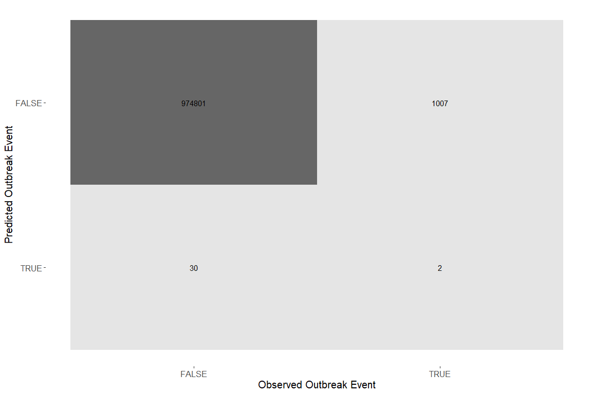
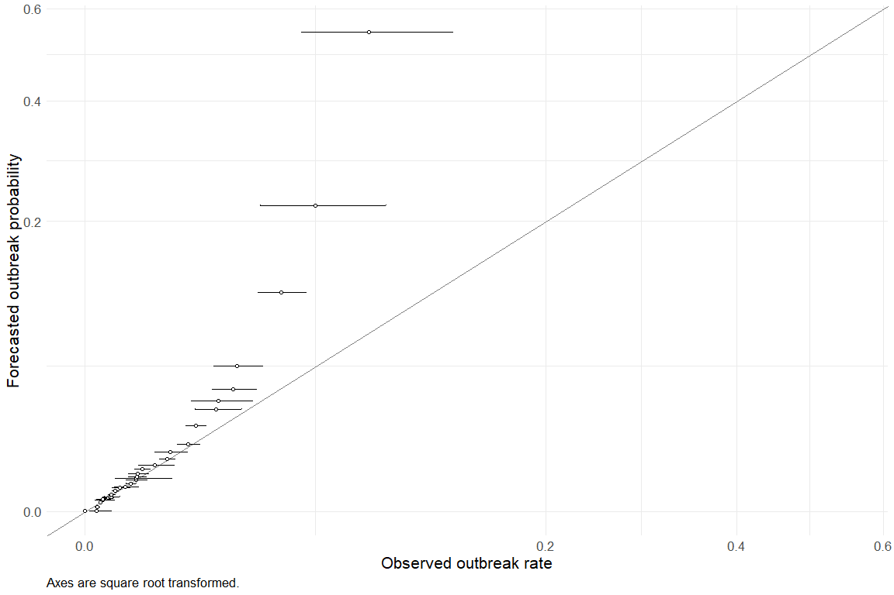
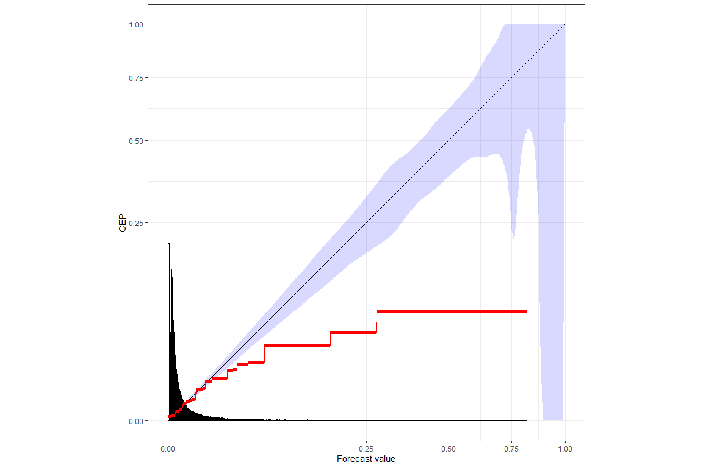

This report documents the evolution of the REPEL crop model as we make updates and improvements upon the original model. It will evolve as we continue to make changes to the data and model.


## Data Summary

### Outbreak reports per priority disease
<table class=" lightable-paper" style='font-family: "Arial Narrow", arial, helvetica, sans-serif; width: auto !important; margin-left: auto; margin-right: auto;'>
 <thead>
  <tr>
   <th style="text-align:left;"> disease </th>
   <th style="text-align:right;"> number of outbreaks in training dataset </th>
   <th style="text-align:right;"> number of outbreaks in full dataset </th>
  </tr>
 </thead>
<tbody>
  <tr>
   <td style="text-align:left;"> 'Candidatus Liberibacter asiaticus' </td>
   <td style="text-align:right;"> 29 </td>
   <td style="text-align:right;"> 32 </td>
  </tr>
  <tr>
   <td style="text-align:left;"> 'Candidatus Liberibacter solanacearum' </td>
   <td style="text-align:right;"> 22 </td>
   <td style="text-align:right;"> 26 </td>
  </tr>
  <tr>
   <td style="text-align:left;"> 'Candidatus Phytoplasma solani' </td>
   <td style="text-align:right;"> 27 </td>
   <td style="text-align:right;"> 33 </td>
  </tr>
  <tr>
   <td style="text-align:left;"> Cotton leaf curl virus </td>
   <td style="text-align:right;"> 2 </td>
   <td style="text-align:right;"> 2 </td>
  </tr>
  <tr>
   <td style="text-align:left;"> Cowpea mild mottle virus </td>
   <td style="text-align:right;"> 13 </td>
   <td style="text-align:right;"> 17 </td>
  </tr>
  <tr>
   <td style="text-align:left;"> Globodera pallida </td>
   <td style="text-align:right;"> 20 </td>
   <td style="text-align:right;"> 27 </td>
  </tr>
  <tr>
   <td style="text-align:left;"> Globodera rostochiensis </td>
   <td style="text-align:right;"> 29 </td>
   <td style="text-align:right;"> 40 </td>
  </tr>
  <tr>
   <td style="text-align:left;"> Oxycarenus hyalinipennis </td>
   <td style="text-align:right;"> 1 </td>
   <td style="text-align:right;"> 1 </td>
  </tr>
  <tr>
   <td style="text-align:left;"> Pantoea stewartii </td>
   <td style="text-align:right;"> 13 </td>
   <td style="text-align:right;"> 14 </td>
  </tr>
  <tr>
   <td style="text-align:left;"> Phakopsora pachyrhizi </td>
   <td style="text-align:right;"> 6 </td>
   <td style="text-align:right;"> 7 </td>
  </tr>
  <tr>
   <td style="text-align:left;"> Plum pox virus </td>
   <td style="text-align:right;"> 33 </td>
   <td style="text-align:right;"> 42 </td>
  </tr>
  <tr>
   <td style="text-align:left;"> Puccinia graminis f. sp. tritici </td>
   <td style="text-align:right;"> 2 </td>
   <td style="text-align:right;"> 2 </td>
  </tr>
  <tr>
   <td style="text-align:left;"> Pyricularia oryzae </td>
   <td style="text-align:right;"> 0 </td>
   <td style="text-align:right;"> 1 </td>
  </tr>
  <tr>
   <td style="text-align:left;"> Pyricularia oryzae Triticum pathotype </td>
   <td style="text-align:right;"> 1 </td>
   <td style="text-align:right;"> 1 </td>
  </tr>
  <tr>
   <td style="text-align:left;"> Ralstonia solanacearum </td>
   <td style="text-align:right;"> 46 </td>
   <td style="text-align:right;"> 56 </td>
  </tr>
  <tr>
   <td style="text-align:left;"> Ralstonia solanacearum race 3 biovar 2 </td>
   <td style="text-align:right;"> 19 </td>
   <td style="text-align:right;"> 21 </td>
  </tr>
  <tr>
   <td style="text-align:left;"> Synchytrium endobioticum </td>
   <td style="text-align:right;"> 10 </td>
   <td style="text-align:right;"> 14 </td>
  </tr>
  <tr>
   <td style="text-align:left;"> Tomato yellow leaf curl virus </td>
   <td style="text-align:right;"> 29 </td>
   <td style="text-align:right;"> 40 </td>
  </tr>
  <tr>
   <td style="text-align:left;"> Xanthomonas oryzae pv. oryzicola </td>
   <td style="text-align:right;"> 5 </td>
   <td style="text-align:right;"> 6 </td>
  </tr>
  <tr>
   <td style="text-align:left;"> Xylella fastidiosa </td>
   <td style="text-align:right;"> 13 </td>
   <td style="text-align:right;"> 14 </td>
  </tr>
  <tr>
   <td style="text-align:left;"> Xylella fastidiosa subsp. fastidiosa </td>
   <td style="text-align:right;"> 3 </td>
   <td style="text-align:right;"> 4 </td>
  </tr>
  <tr>
   <td style="text-align:left;"> Xylella fastidiosa subsp. multiplex </td>
   <td style="text-align:right;"> 4 </td>
   <td style="text-align:right;"> 5 </td>
  </tr>
  <tr>
   <td style="text-align:left;"> Xylella fastidiosa subsp. pauca </td>
   <td style="text-align:right;"> 5 </td>
   <td style="text-align:right;"> 5 </td>
  </tr>
</tbody>
</table>

### Percent of priority disease reports flagged and manually reviewed
<table class=" lightable-paper" style='font-family: "Arial Narrow", arial, helvetica, sans-serif; width: auto !important; margin-left: auto; margin-right: auto;'>
 <thead>
  <tr>
   <th style="text-align:left;"> field </th>
   <th style="text-align:right;"> number of reports </th>
   <th style="text-align:right;"> percent of total reports </th>
   <th style="text-align:right;"> percent reviewed </th>
  </tr>
 </thead>
<tbody>
  <tr>
   <td style="text-align:left;"> disease </td>
   <td style="text-align:right;"> 322 </td>
   <td style="text-align:right;"> 0.276 </td>
   <td style="text-align:right;"> 1 </td>
  </tr>
  <tr>
   <td style="text-align:left;"> year </td>
   <td style="text-align:right;"> 59 </td>
   <td style="text-align:right;"> 0.051 </td>
   <td style="text-align:right;"> 1 </td>
  </tr>
  <tr>
   <td style="text-align:left;"> presence </td>
   <td style="text-align:right;"> 59 </td>
   <td style="text-align:right;"> 0.051 </td>
   <td style="text-align:right;"> 1 </td>
  </tr>
</tbody>
</table>

### Scoring statistics
<table class=" lightable-paper" style='font-family: "Arial Narrow", arial, helvetica, sans-serif; width: auto !important; margin-left: auto; margin-right: auto;'>
 <thead>
  <tr>
   <th style="text-align:left;"> field </th>
   <th style="text-align:left;"> assessment </th>
   <th style="text-align:left;"> flagged </th>
   <th style="text-align:left;"> combined </th>
  </tr>
 </thead>
<tbody>
  <tr>
   <td style="text-align:left;"> number of reports </td>
   <td style="text-align:left;"> 264 </td>
   <td style="text-align:left;"> 436 </td>
   <td style="text-align:left;"> 700 </td>
  </tr>
  <tr>
   <td style="text-align:left;"> year </td>
   <td style="text-align:left;"> 0.826 </td>
   <td style="text-align:left;"> 0.688 </td>
   <td style="text-align:left;"> 0.74 </td>
  </tr>
  <tr>
   <td style="text-align:left;"> month </td>
   <td style="text-align:left;"> 0.848 </td>
   <td style="text-align:left;"> 0.81 </td>
   <td style="text-align:left;"> 0.824 </td>
  </tr>
  <tr>
   <td style="text-align:left;"> presence </td>
   <td style="text-align:left;"> 0.951 </td>
   <td style="text-align:left;"> 0.851 </td>
   <td style="text-align:left;"> 0.889 </td>
  </tr>
</tbody>
</table>

## Model Summary


```
## Generalized linear mixed model fit by maximum likelihood (Adaptive
##   Gauss-Hermite Quadrature, nAGQ = 0) [glmerMod]
##  Family: binomial  ( logit )
## Formula: 
## outbreak_start ~ (0 + continent | disease) + (0 + kingdom | disease) +  
##     (0 + shared_borders_from_outbreaks | disease) + (0 + log_comtrade_dollars_from_outbreaks |  
##     disease) + (0 + log_fao_crop_quantity_from_outbreaks | disease) +  
##     (0 + log_n_migratory_wildlife_from_outbreaks | disease) +  
##     (0 + log_gdp_dollars | disease) + (0 + log_human_population |  
##     disease) + (0 + log_crop_production | disease)
##    Data: augmented_data_compressed
## Weights: wgts
## Control: lme4::glmerControl(calc.derivs = FALSE)
## 
##       AIC       BIC    logLik  deviance  df.resid 
##   48397.9   48939.7  -24154.9   48309.9   1647954 
## 
## Scaled residuals: 
##    Min     1Q Median     3Q    Max 
##  -1.72  -0.04  -0.02  -0.01 581.07 
## 
## Random effects:
##  Groups    Name                                    Variance  Std.Dev. Corr 
##  disease   continentAfrica                         2.481e-01 0.498050      
##            continentAmericas                       1.700e+00 1.303824 -0.13
##            continentAsia                           4.541e-01 0.673841  0.36
##            continentEurope                         2.783e+00 1.668235 -0.67
##            continentOceania                        6.357e-01 0.797291  0.08
##  disease.1 kingdomAnimalia                         1.229e+00 1.108677      
##            kingdomBacteria                         1.764e+00 1.328306 -0.15
##            kingdomChromista                        9.979e-05 0.009989 -0.69
##            kingdomFungi                            1.619e-05 0.004023  0.51
##            kingdomProtista                         4.653e+00 2.157003  0.20
##            kingdomViruses and viroids              1.200e+00 1.095233  0.20
##  disease.2 shared_borders_from_outbreaks           1.440e-02 0.120010      
##  disease.3 log_comtrade_dollars_from_outbreaks     3.853e-02 0.196280      
##  disease.4 log_fao_crop_quantity_from_outbreaks    3.865e-01 0.621659      
##  disease.5 log_n_migratory_wildlife_from_outbreaks 2.416e-01 0.491570      
##  disease.6 log_gdp_dollars                         3.734e+00 1.932482      
##  disease.7 log_human_population                    1.304e-01 0.361146      
##  disease.8 log_crop_production                     2.058e+00 1.434604      
##                         
##                         
##                         
##  -0.07                  
##  -0.42  0.27            
##   0.41 -0.26 -0.43      
##                         
##                         
##   0.79                  
##   0.12 -0.11            
##  -0.06 -0.30 -0.07      
##  -0.02 -0.14  0.15  0.39
##                         
##                         
##                         
##                         
##                         
##                         
##                         
## Number of obs: 1647998, groups:  disease, 760
## 
## Fixed effects:
##             Estimate Std. Error z value Pr(>|z|)    
## (Intercept) -8.45240    0.05326  -158.7   <2e-16 ***
## ---
## Signif. codes:  0 '***' 0.001 '**' 0.01 '*' 0.05 '.' 0.1 ' ' 1
## optimizer (bobyqa) convergence code: 1 (bobyqa -- maximum number of function evaluations exceeded)
## maxfun < 10 * length(par)^2 is not recommended.
```

## Model Performance

### Confusion Matrix

Model predictions are in the form of probabilities from 0-1.
We assumed that a prediction of \>= 0.5 indicates that the model predicted an outbreak event.

While confusion matrices and their summary statistics are standard metrics for binary models, they are limited for evaluating this model, which predicts rare events that generally have a probability well below 0.5.
Metrics which weight negative events reflect the large number of zeroes in the dataset.
Metrics focusing only on rare outbreak events (Kappa, Negative Predictive Value, Matthews correlation coefficient) reflect performance in very small number of cases where monthly import risk is above 50%.
Calibration curves (next section) provide a better measure of rare events.

<!-- -->

<table class=" lightable-paper" style='font-family: "Arial Narrow", arial, helvetica, sans-serif; width: auto !important; '>
 <thead>
  <tr>
   <th style="text-align:left;"> .metric </th>
   <th style="text-align:left;"> .estimator </th>
   <th style="text-align:right;"> .estimate </th>
  </tr>
 </thead>
<tbody>
  <tr>
   <td style="text-align:left;"> accuracy </td>
   <td style="text-align:left;"> binary </td>
   <td style="text-align:right;"> 0.9989373 </td>
  </tr>
  <tr>
   <td style="text-align:left;"> kap </td>
   <td style="text-align:left;"> binary </td>
   <td style="text-align:right;"> 0.0037791 </td>
  </tr>
  <tr>
   <td style="text-align:left;"> sens </td>
   <td style="text-align:left;"> binary </td>
   <td style="text-align:right;"> 0.9999692 </td>
  </tr>
  <tr>
   <td style="text-align:left;"> spec </td>
   <td style="text-align:left;"> binary </td>
   <td style="text-align:right;"> 0.0019822 </td>
  </tr>
  <tr>
   <td style="text-align:left;"> ppv </td>
   <td style="text-align:left;"> binary </td>
   <td style="text-align:right;"> 0.9989680 </td>
  </tr>
  <tr>
   <td style="text-align:left;"> npv </td>
   <td style="text-align:left;"> binary </td>
   <td style="text-align:right;"> 0.0625000 </td>
  </tr>
  <tr>
   <td style="text-align:left;"> mcc </td>
   <td style="text-align:left;"> binary </td>
   <td style="text-align:right;"> 0.0109521 </td>
  </tr>
  <tr>
   <td style="text-align:left;"> j_index </td>
   <td style="text-align:left;"> binary </td>
   <td style="text-align:right;"> 0.0019514 </td>
  </tr>
  <tr>
   <td style="text-align:left;"> bal_accuracy </td>
   <td style="text-align:left;"> binary </td>
   <td style="text-align:right;"> 0.5009757 </td>
  </tr>
  <tr>
   <td style="text-align:left;"> detection_prevalence </td>
   <td style="text-align:left;"> binary </td>
   <td style="text-align:right;"> 0.9999672 </td>
  </tr>
  <tr>
   <td style="text-align:left;"> precision </td>
   <td style="text-align:left;"> binary </td>
   <td style="text-align:right;"> 0.9989680 </td>
  </tr>
  <tr>
   <td style="text-align:left;"> recall </td>
   <td style="text-align:left;"> binary </td>
   <td style="text-align:right;"> 0.9999692 </td>
  </tr>
  <tr>
   <td style="text-align:left;"> f_meas </td>
   <td style="text-align:left;"> binary </td>
   <td style="text-align:right;"> 0.9994684 </td>
  </tr>
</tbody>
</table>

### Calibration Curve

We assessed model predictions as probabilities against observed outbreak rates in the validation set.
We grouped predictions into 30 quantile-based bins.
We compared the average prediction of each bin to observed outbreak rates within the bin (represented as binomial probabilities and 95% confidence intervals).
Each prediction represents the expectation of an outbreak of a given disease in a country in a given month.
This assessment evaluates the reliability of predictions for rare events: given a predicted probability of a rare outbreak, how well is that probability borne out as a fraction of times that outbreaks actually occurred in the validation data?


<!-- -->

<table class=" lightable-paper" style='font-family: "Arial Narrow", arial, helvetica, sans-serif; width: auto !important; '>
<caption>values are per 10,000 potential events</caption>
 <thead>
  <tr>
   <th style="text-align:right;"> Mean Prediction </th>
   <th style="text-align:left;"> Observed Outbreak Rate (mean and 95%CI) </th>
   <th style="text-align:left;"> Mean Prediction within 95%CI </th>
  </tr>
 </thead>
<tbody>
  <tr>
   <td style="text-align:right;"> 0.00013 </td>
   <td style="text-align:left;"> 0 (-2.7e-16-3.3) </td>
   <td style="text-align:left;"> yes </td>
  </tr>
  <tr>
   <td style="text-align:right;"> 0.00073 </td>
   <td style="text-align:left;"> 1.2 (0.21-6.7) </td>
   <td style="text-align:left;"> no </td>
  </tr>
  <tr>
   <td style="text-align:right;"> 0.42000 </td>
   <td style="text-align:left;"> 1.4 (0.87-2.2) </td>
   <td style="text-align:left;"> no </td>
  </tr>
  <tr>
   <td style="text-align:right;"> 2.00000 </td>
   <td style="text-align:left;"> 2.2 (1.8-2.7) </td>
   <td style="text-align:left;"> yes </td>
  </tr>
  <tr>
   <td style="text-align:right;"> 3.20000 </td>
   <td style="text-align:left;"> 2.8 (0.96-8.3) </td>
   <td style="text-align:left;"> yes </td>
  </tr>
  <tr>
   <td style="text-align:right;"> 3.40000 </td>
   <td style="text-align:left;"> 2.8 (1.2-6.6) </td>
   <td style="text-align:left;"> yes </td>
  </tr>
  <tr>
   <td style="text-align:right;"> 3.70000 </td>
   <td style="text-align:left;"> 4.5 (2.7-7.6) </td>
   <td style="text-align:left;"> yes </td>
  </tr>
  <tr>
   <td style="text-align:right;"> 4.30000 </td>
   <td style="text-align:left;"> 4.9 (2.9-8) </td>
   <td style="text-align:left;"> yes </td>
  </tr>
  <tr>
   <td style="text-align:right;"> 4.80000 </td>
   <td style="text-align:left;"> 5.6 (3-11) </td>
   <td style="text-align:left;"> yes </td>
  </tr>
  <tr>
   <td style="text-align:right;"> 5.20000 </td>
   <td style="text-align:left;"> 6.3 (3.5-11) </td>
   <td style="text-align:left;"> yes </td>
  </tr>
  <tr>
   <td style="text-align:right;"> 6.60000 </td>
   <td style="text-align:left;"> 6.6 (4.9-8.8) </td>
   <td style="text-align:left;"> yes </td>
  </tr>
  <tr>
   <td style="text-align:right;"> 10.00000 </td>
   <td style="text-align:left;"> 8.7 (6.6-11) </td>
   <td style="text-align:left;"> yes </td>
  </tr>
  <tr>
   <td style="text-align:right;"> 13.00000 </td>
   <td style="text-align:left;"> 12 (6.7-20) </td>
   <td style="text-align:left;"> yes </td>
  </tr>
  <tr>
   <td style="text-align:right;"> 14.00000 </td>
   <td style="text-align:left;"> 15 (8.1-27) </td>
   <td style="text-align:left;"> yes </td>
  </tr>
  <tr>
   <td style="text-align:right;"> 18.00000 </td>
   <td style="text-align:left;"> 19 (15-25) </td>
   <td style="text-align:left;"> yes </td>
  </tr>
  <tr>
   <td style="text-align:right;"> 24.00000 </td>
   <td style="text-align:left;"> 24 (16-37) </td>
   <td style="text-align:left;"> yes </td>
  </tr>
  <tr>
   <td style="text-align:right;"> 25.00000 </td>
   <td style="text-align:left;"> 24 (8.3-71) </td>
   <td style="text-align:left;"> yes </td>
  </tr>
  <tr>
   <td style="text-align:right;"> 28.00000 </td>
   <td style="text-align:left;"> 25 (18-36) </td>
   <td style="text-align:left;"> yes </td>
  </tr>
  <tr>
   <td style="text-align:right;"> 33.00000 </td>
   <td style="text-align:left;"> 26 (18-39) </td>
   <td style="text-align:left;"> yes </td>
  </tr>
  <tr>
   <td style="text-align:right;"> 43.00000 </td>
   <td style="text-align:left;"> 30 (23-40) </td>
   <td style="text-align:left;"> no </td>
  </tr>
  <tr>
   <td style="text-align:right;"> 51.00000 </td>
   <td style="text-align:left;"> 46 (27-76) </td>
   <td style="text-align:left;"> yes </td>
  </tr>
  <tr>
   <td style="text-align:right;"> 66.00000 </td>
   <td style="text-align:left;"> 63 (52-78) </td>
   <td style="text-align:left;"> yes </td>
  </tr>
  <tr>
   <td style="text-align:right;"> 84.00000 </td>
   <td style="text-align:left;"> 68 (46-100) </td>
   <td style="text-align:left;"> yes </td>
  </tr>
  <tr>
   <td style="text-align:right;"> 110.00000 </td>
   <td style="text-align:left;"> 100 (80-120) </td>
   <td style="text-align:left;"> yes </td>
  </tr>
  <tr>
   <td style="text-align:right;"> 170.00000 </td>
   <td style="text-align:left;"> 110 (95-140) </td>
   <td style="text-align:left;"> no </td>
  </tr>
  <tr>
   <td style="text-align:right;"> 250.00000 </td>
   <td style="text-align:left;"> 160 (110-230) </td>
   <td style="text-align:left;"> no </td>
  </tr>
  <tr>
   <td style="text-align:right;"> 290.00000 </td>
   <td style="text-align:left;"> 170 (110-260) </td>
   <td style="text-align:left;"> no </td>
  </tr>
  <tr>
   <td style="text-align:right;"> 360.00000 </td>
   <td style="text-align:left;"> 210 (150-280) </td>
   <td style="text-align:left;"> no </td>
  </tr>
  <tr>
   <td style="text-align:right;"> 500.00000 </td>
   <td style="text-align:left;"> 220 (160-300) </td>
   <td style="text-align:left;"> no </td>
  </tr>
  <tr>
   <td style="text-align:right;"> 1100.00000 </td>
   <td style="text-align:left;"> 360 (280-460) </td>
   <td style="text-align:left;"> no </td>
  </tr>
  <tr>
   <td style="text-align:right;"> 2200.00000 </td>
   <td style="text-align:left;"> 500 (290-850) </td>
   <td style="text-align:left;"> no </td>
  </tr>
  <tr>
   <td style="text-align:right;"> 5500.00000 </td>
   <td style="text-align:left;"> 760 (440-1300) </td>
   <td style="text-align:left;"> no </td>
  </tr>
</tbody>
</table>

Across the range of predictions, the average predicted probability matches the observed fraction of events (by falling within binomial confidence intervals) in 21 of 32 bins.


### Reliability Diagram
From https://www.pnas.org/doi/full/10.1073/pnas.2016191118

Uses the pool-adjacent-violators algorithm to generate optimally binned, reproducible, and provably statistically consistent reliability diagrams.

Mean Score (S) is the event rate in the dataset (` mean(as.integer(repel_validation_predict_crop$outbreak_start))`)

Uncertainty (UNC) is the mean score of a constant prediction at the value of the average observation. It is the highest possible mean score of a calibrated prediction method. It measures the inherent difficulty of the prediction problem, but does not depend on the forecast under consideration.

Discrimination (DSC) is UNC minus the mean score of the PAV-recalibrated forecast values. A small value indicates a low information content (low signal) in the original forecast values. Increasing value indicates model improvement. 

Miscalibration (MCB) is S minus the mean score of the PAV-recalibrated forecast values. A high value indicates that predictive performance of the prediction method can be improved by recalibration. Decreasing value indicates model improvement. 

These measures are related by the following equation:
S=MCB−DSC+UNC.


<!-- --><table class=" lightable-paper" style='font-family: "Arial Narrow", arial, helvetica, sans-serif; width: auto !important; '>
 <thead>
  <tr>
   <th style="text-align:right;"> mean_score </th>
   <th style="text-align:right;"> miscalibration </th>
   <th style="text-align:right;"> discrimination </th>
   <th style="text-align:right;"> uncertainty </th>
  </tr>
 </thead>
<tbody>
  <tr>
   <td style="text-align:right;"> 0.0010629 </td>
   <td style="text-align:right;"> 0.0000386 </td>
   <td style="text-align:right;"> 0.0000086 </td>
   <td style="text-align:right;"> 0.0010329 </td>
  </tr>
</tbody>
</table>


<details>

<summary>Session info</summary>

-   Built at: 2024-05-30 23:59:32.316138
-   Last git commit hash: 2cdeb8c617640df75df32cecbfc5bf12156d4be8

</details>

