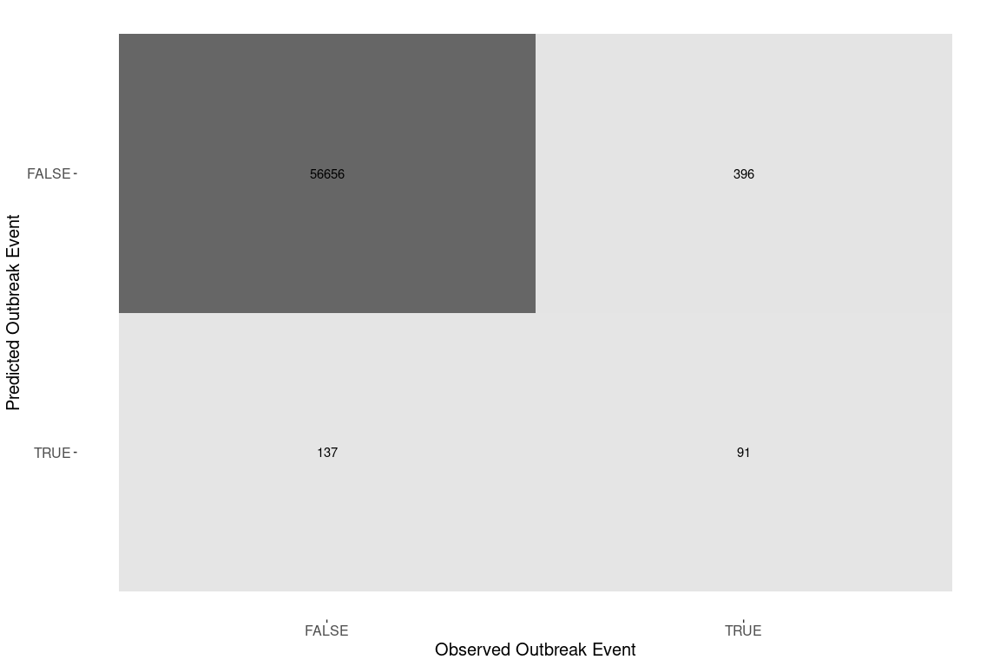
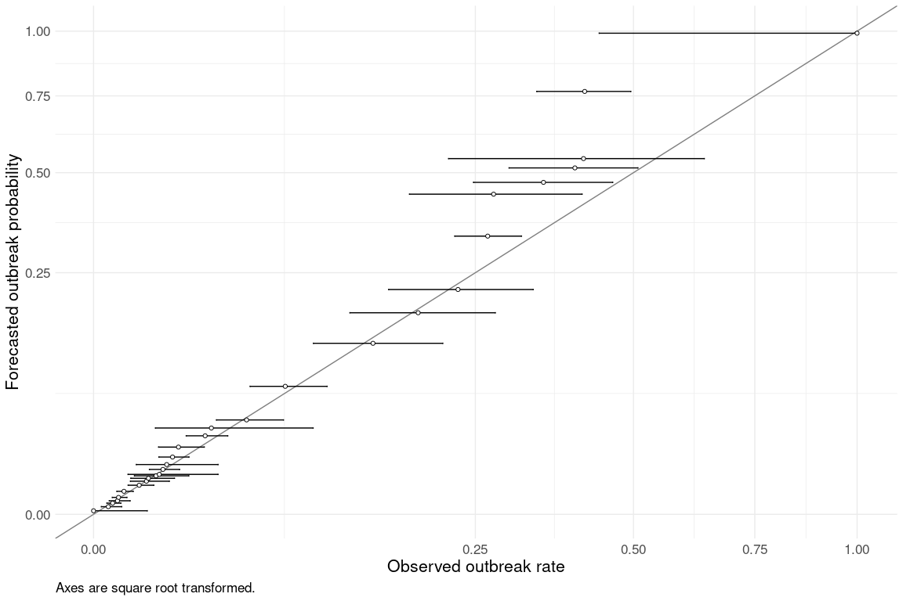
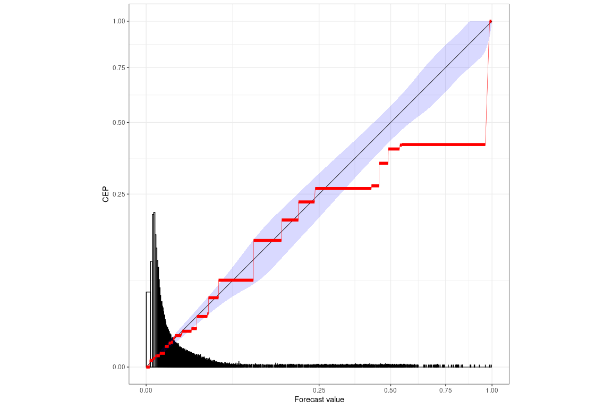

This report documents the evolution of the REPEL livestock model as we make updates and improvements upon the replicated original model. It will evolve as we continue to make changes to the data and model. The "replicated original model" Phase II model report is available via Release 0.2.3 https://github.com/ecohealthalliance/repel2-battelle/releases/tag/v0.2.3

The following changes are reflected in this report:

1. WAHIS disease and taxa names have been fully cleaned and standardized
2. No longer remove diseases that only occur in a single country from the model dataset
3. We filter out diseases that affect non-livestock for which we do not have population data: bees, dogs, wolves, chimps
4. We no longer exclude birds from wildlife migration metrics
5. We added a monthly time period offset for outbreak predictions
6. Use outbreak table to fill in NAs in wahis events closing dates
7. We shifted the model to a yearly time interval
8. Removed non-livestock related commodities from the Comtrade dataset
9. Filter training data to 2006-2022. Also fixed a bug from the offset refactoring that might have been removing some COMTRADE/FAO data.
10. Updating `targets` package to version 1.4.0 changed pseudo-random number generator seeds, which resulted in a different train/validation split. 
11. Add two predictor variables `disease_present_anywhere` for whether the disease is present anywhere in the world and `outbreak_previous` for whether the disease has ever occurred previously in the given country. 
12. Downgraded `targets` package to version 1.3.2 due to conflicts with our internal AWS-based collaborative workflow. This again changes pseudo-random number generator seeds.
13. Log transform comtrade, fao, wildlife migration
14. Remove NOWCAST model imputation for endemic events


## Model Summary


```
## Generalized linear mixed model fit by maximum likelihood (Adaptive
##   Gauss-Hermite Quadrature, nAGQ = 0) [glmerMod]
##  Family: binomial  ( logit )
## Formula: 
## outbreak_start ~ (0 + continent | disease) + (0 + shared_borders_from_outbreaks |  
##     disease) + (0 + log_comtrade_dollars_from_outbreaks | disease) +  
##     (0 + log_fao_livestock_heads_from_outbreaks | disease) +  
##     (0 + log_n_migratory_wildlife_from_outbreaks | disease) +  
##     (0 + log_gdp_dollars | disease) + (0 + log_human_population |  
##     disease) + (0 + log_target_taxa_population | disease) + (0 +  
##     log_veterinarians | disease) + (0 + disease_present_anywhere |  
##     disease) + (0 + outbreak_previous | disease)
##    Data: augmented_data_compressed
## Weights: wgts
## Control: lme4::glmerControl(calc.derivs = TRUE)
## 
##      AIC      BIC   logLik deviance df.resid 
##  10933.2  11234.6  -5436.6  10873.2   170592 
## 
## Scaled residuals: 
##    Min     1Q Median     3Q    Max 
## -2.065 -0.058 -0.034 -0.024 33.722 
## 
## Random effects:
##  Groups     Name                                    Variance Std.Dev. Corr 
##  disease    continentAfrica                          1.92286 1.3867        
##             continentAmericas                        1.07273 1.0357   -0.45
##             continentAsia                            1.60793 1.2680    0.73
##             continentEurope                          1.82977 1.3527    0.05
##             continentOceania                         0.21450 0.4631   -0.54
##  disease.1  shared_borders_from_outbreaks            0.01563 0.1250        
##  disease.2  log_comtrade_dollars_from_outbreaks      0.08779 0.2963        
##  disease.3  log_fao_livestock_heads_from_outbreaks   0.03958 0.1989        
##  disease.4  log_n_migratory_wildlife_from_outbreaks  0.16097 0.4012        
##  disease.5  log_gdp_dollars                          0.48799 0.6986        
##  disease.6  log_human_population                     0.01292 0.1137        
##  disease.7  log_target_taxa_population               0.45871 0.6773        
##  disease.8  log_veterinarians                        0.01323 0.1150        
##  disease.9  disease_present_anywhereFALSE            0.00000 0.0000        
##             disease_present_anywhereTRUE             0.80391 0.8966    NaN 
##  disease.10 outbreak_previousFALSE                   0.00000 0.0000        
##             outbreak_previousTRUE                   17.88794 4.2294    NaN 
##                   
##                   
##                   
##   0.20            
##   0.63  0.50      
##   0.76 -0.13  0.76
##                   
##                   
##                   
##                   
##                   
##                   
##                   
##                   
##                   
##                   
##                   
##                   
## Number of obs: 170622, groups:  disease, 80
## 
## Fixed effects:
##             Estimate Std. Error z value Pr(>|z|)    
## (Intercept)  -6.5500     0.1271  -51.55   <2e-16 ***
## ---
## Signif. codes:  0 '***' 0.001 '**' 0.01 '*' 0.05 '.' 0.1 ' ' 1
## optimizer (bobyqa) convergence code: 0 (OK)
## boundary (singular) fit: see help('isSingular')
```

## Model Performance

### Confusion Matrix

Model predictions are in the form of probabilities from 0-1.
We assumed that a prediction of \>= 0.5 indicates that the model predicted an outbreak event.

While confusion matrices and their summary statistics are standard metrics for binary models, they are limited for evaluating this model, which predicts rare events that generally have a probability well below 0.5.
Metrics which weight negative events reflect the large number of zeroes in the dataset.
Metrics focusing only on rare outbreak events (Kappa, Negative Predictive Value, Matthews correlation coefficient) reflect performance in very small number of cases where monthly import risk is above 50%.
Calibration curves (next section) provide a better measure of rare events.

<!-- -->

<table class=" lightable-paper" style='font-family: "Arial Narrow", arial, helvetica, sans-serif; width: auto !important; '>
 <thead>
  <tr>
   <th style="text-align:left;"> .metric </th>
   <th style="text-align:left;"> .estimator </th>
   <th style="text-align:right;"> .estimate </th>
  </tr>
 </thead>
<tbody>
  <tr>
   <td style="text-align:left;"> accuracy </td>
   <td style="text-align:left;"> binary </td>
   <td style="text-align:right;"> 0.9906948 </td>
  </tr>
  <tr>
   <td style="text-align:left;"> kap </td>
   <td style="text-align:left;"> binary </td>
   <td style="text-align:right;"> 0.2504813 </td>
  </tr>
  <tr>
   <td style="text-align:left;"> sens </td>
   <td style="text-align:left;"> binary </td>
   <td style="text-align:right;"> 0.9975877 </td>
  </tr>
  <tr>
   <td style="text-align:left;"> spec </td>
   <td style="text-align:left;"> binary </td>
   <td style="text-align:right;"> 0.1868583 </td>
  </tr>
  <tr>
   <td style="text-align:left;"> ppv </td>
   <td style="text-align:left;"> binary </td>
   <td style="text-align:right;"> 0.9930590 </td>
  </tr>
  <tr>
   <td style="text-align:left;"> npv </td>
   <td style="text-align:left;"> binary </td>
   <td style="text-align:right;"> 0.3991228 </td>
  </tr>
  <tr>
   <td style="text-align:left;"> mcc </td>
   <td style="text-align:left;"> binary </td>
   <td style="text-align:right;"> 0.2689542 </td>
  </tr>
  <tr>
   <td style="text-align:left;"> j_index </td>
   <td style="text-align:left;"> binary </td>
   <td style="text-align:right;"> 0.1844460 </td>
  </tr>
  <tr>
   <td style="text-align:left;"> bal_accuracy </td>
   <td style="text-align:left;"> binary </td>
   <td style="text-align:right;"> 0.5922230 </td>
  </tr>
  <tr>
   <td style="text-align:left;"> detection_prevalence </td>
   <td style="text-align:left;"> binary </td>
   <td style="text-align:right;"> 0.9960196 </td>
  </tr>
  <tr>
   <td style="text-align:left;"> precision </td>
   <td style="text-align:left;"> binary </td>
   <td style="text-align:right;"> 0.9930590 </td>
  </tr>
  <tr>
   <td style="text-align:left;"> recall </td>
   <td style="text-align:left;"> binary </td>
   <td style="text-align:right;"> 0.9975877 </td>
  </tr>
  <tr>
   <td style="text-align:left;"> f_meas </td>
   <td style="text-align:left;"> binary </td>
   <td style="text-align:right;"> 0.9953182 </td>
  </tr>
</tbody>
</table>

### Calibration Curve

We assessed model predictions as probabilities against observed outbreak rates in the validation set.
We grouped predictions into 30 quantile-based bins.
We compared the average prediction of each bin to observed outbreak rates within the bin (represented as binomial probabilities and 95% confidence intervals).
Each prediction represents the expectation of an outbreak of a given disease in a country in a given month.
This assessment evaluates the reliability of predictions for rare events: given a predicted probability of a rare outbreak, how well is that probability borne out as a fraction of times that outbreaks actually occurred in the validation data?


<!-- -->

<table class=" lightable-paper" style='font-family: "Arial Narrow", arial, helvetica, sans-serif; width: auto !important; '>
<caption>values are per 10,000 potential events</caption>
 <thead>
  <tr>
   <th style="text-align:right;"> Mean Prediction </th>
   <th style="text-align:left;"> Observed Outbreak Rate (mean and 95%CI) </th>
   <th style="text-align:left;"> Mean Prediction within 95%CI </th>
  </tr>
 </thead>
<tbody>
  <tr>
   <td style="text-align:right;"> 0.54 </td>
   <td style="text-align:left;"> 0 (0-50) </td>
   <td style="text-align:left;"> yes </td>
  </tr>
  <tr>
   <td style="text-align:right;"> 2.50 </td>
   <td style="text-align:left;"> 3.7 (1-14) </td>
   <td style="text-align:left;"> yes </td>
  </tr>
  <tr>
   <td style="text-align:right;"> 5.40 </td>
   <td style="text-align:left;"> 6.2 (3-13) </td>
   <td style="text-align:left;"> yes </td>
  </tr>
  <tr>
   <td style="text-align:right;"> 7.80 </td>
   <td style="text-align:left;"> 9.8 (4.2-23) </td>
   <td style="text-align:left;"> yes </td>
  </tr>
  <tr>
   <td style="text-align:right;"> 12.00 </td>
   <td style="text-align:left;"> 11 (6-19) </td>
   <td style="text-align:left;"> yes </td>
  </tr>
  <tr>
   <td style="text-align:right;"> 23.00 </td>
   <td style="text-align:left;"> 16 (9.3-27) </td>
   <td style="text-align:left;"> yes </td>
  </tr>
  <tr>
   <td style="text-align:right;"> 36.00 </td>
   <td style="text-align:left;"> 36 (20-62) </td>
   <td style="text-align:left;"> yes </td>
  </tr>
  <tr>
   <td style="text-align:right;"> 47.00 </td>
   <td style="text-align:left;"> 48 (23-99) </td>
   <td style="text-align:left;"> yes </td>
  </tr>
  <tr>
   <td style="text-align:right;"> 56.00 </td>
   <td style="text-align:left;"> 52 (24-110) </td>
   <td style="text-align:left;"> yes </td>
  </tr>
  <tr>
   <td style="text-align:right;"> 63.00 </td>
   <td style="text-align:left;"> 67 (29-160) </td>
   <td style="text-align:left;"> yes </td>
  </tr>
  <tr>
   <td style="text-align:right;"> 68.00 </td>
   <td style="text-align:left;"> 74 (20-270) </td>
   <td style="text-align:left;"> yes </td>
  </tr>
  <tr>
   <td style="text-align:right;"> 86.00 </td>
   <td style="text-align:left;"> 83 (53-130) </td>
   <td style="text-align:left;"> yes </td>
  </tr>
  <tr>
   <td style="text-align:right;"> 110.00 </td>
   <td style="text-align:left;"> 92 (31-270) </td>
   <td style="text-align:left;"> yes </td>
  </tr>
  <tr>
   <td style="text-align:right;"> 140.00 </td>
   <td style="text-align:left;"> 110 (73-160) </td>
   <td style="text-align:left;"> yes </td>
  </tr>
  <tr>
   <td style="text-align:right;"> 190.00 </td>
   <td style="text-align:left;"> 120 (72-210) </td>
   <td style="text-align:left;"> yes </td>
  </tr>
  <tr>
   <td style="text-align:right;"> 260.00 </td>
   <td style="text-align:left;"> 210 (150-310) </td>
   <td style="text-align:left;"> yes </td>
  </tr>
  <tr>
   <td style="text-align:right;"> 320.00 </td>
   <td style="text-align:left;"> 240 (66-830) </td>
   <td style="text-align:left;"> yes </td>
  </tr>
  <tr>
   <td style="text-align:right;"> 380.00 </td>
   <td style="text-align:left;"> 400 (260-620) </td>
   <td style="text-align:left;"> yes </td>
  </tr>
  <tr>
   <td style="text-align:right;"> 700.00 </td>
   <td style="text-align:left;"> 630 (420-940) </td>
   <td style="text-align:left;"> yes </td>
  </tr>
  <tr>
   <td style="text-align:right;"> 1300.00 </td>
   <td style="text-align:left;"> 1300 (830-2100) </td>
   <td style="text-align:left;"> yes </td>
  </tr>
  <tr>
   <td style="text-align:right;"> 1700.00 </td>
   <td style="text-align:left;"> 1800 (1100-2800) </td>
   <td style="text-align:left;"> yes </td>
  </tr>
  <tr>
   <td style="text-align:right;"> 2200.00 </td>
   <td style="text-align:left;"> 2300 (1500-3300) </td>
   <td style="text-align:left;"> yes </td>
  </tr>
  <tr>
   <td style="text-align:right;"> 3300.00 </td>
   <td style="text-align:left;"> 2700 (2200-3100) </td>
   <td style="text-align:left;"> no </td>
  </tr>
  <tr>
   <td style="text-align:right;"> 4400.00 </td>
   <td style="text-align:left;"> 2700 (1700-4100) </td>
   <td style="text-align:left;"> no </td>
  </tr>
  <tr>
   <td style="text-align:right;"> 4700.00 </td>
   <td style="text-align:left;"> 3500 (2500-4600) </td>
   <td style="text-align:left;"> no </td>
  </tr>
  <tr>
   <td style="text-align:right;"> 5100.00 </td>
   <td style="text-align:left;"> 4000 (3000-5100) </td>
   <td style="text-align:left;"> no </td>
  </tr>
  <tr>
   <td style="text-align:right;"> 5400.00 </td>
   <td style="text-align:left;"> 4100 (2200-6400) </td>
   <td style="text-align:left;"> yes </td>
  </tr>
  <tr>
   <td style="text-align:right;"> 7700.00 </td>
   <td style="text-align:left;"> 4100 (3400-5000) </td>
   <td style="text-align:left;"> no </td>
  </tr>
  <tr>
   <td style="text-align:right;"> 9900.00 </td>
   <td style="text-align:left;"> 10000 (4400-10000) </td>
   <td style="text-align:left;"> yes </td>
  </tr>
</tbody>
</table>

Across the range of predictions, the average predicted probability matches the observed fraction of events (by falling within binomial confidence intervals) in 24 of 29 bins.

### Reliability Diagram
From https://www.pnas.org/doi/full/10.1073/pnas.2016191118

Uses the pool-adjacent-violators algorithm to generate optimally binned, reproducible, and provably statistically consistent reliability diagrams.

Mean Score (S) is the event rate in the dataset (` mean(as.integer(repel_validation_predict_crop$outbreak_start))`)

Uncertainty (UNC) is the mean score of a constant prediction at the value of the average observation. It is the highest possible mean score of a calibrated prediction method. It measures the inherent difficulty of the prediction problem, but does not depend on the forecast under consideration.

Discrimination (DSC) is UNC minus the mean score of the PAV-recalibrated forecast values. A small value indicates a low information content (low signal) in the original forecast values. Increasing value indicates model improvement. 

Miscalibration (MCB) is S minus the mean score of the PAV-recalibrated forecast values. A high value indicates that predictive performance of the prediction method can be improved by recalibration. Decreasing value indicates model improvement. 

These measures are related by the following equation:
S=MCB−DSC+UNC.


<!-- --><table class=" lightable-paper" style='font-family: "Arial Narrow", arial, helvetica, sans-serif; width: auto !important; '>
 <thead>
  <tr>
   <th style="text-align:right;"> mean_score </th>
   <th style="text-align:right;"> miscalibration </th>
   <th style="text-align:right;"> discrimination </th>
   <th style="text-align:right;"> uncertainty </th>
  </tr>
 </thead>
<tbody>
  <tr>
   <td style="text-align:right;"> 0.0072683 </td>
   <td style="text-align:right;"> 0.0004042 </td>
   <td style="text-align:right;"> 0.0015658 </td>
   <td style="text-align:right;"> 0.0084298 </td>
  </tr>
</tbody>
</table>


<details>

<summary>Session info</summary>

-   Built at: 2024-05-31 15:22:55.198805
-   Last git commit hash: 6e56f9f2cfb7ec5a5483924c57e8e6d4f99ebef3

</details>

